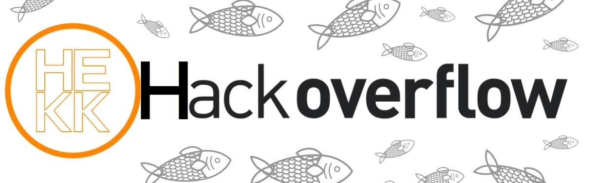

<!-- Improved compatibility of back to top link: See: https://github.com/othneildrew/Best-README-Template/pull/73 -->
<a name="readme-top"></a>
<!--
*** Thanks for checking out the Best-README-Template. If you have a suggestion
*** that would make this better, please fork the repo and create a pull request
*** or simply open an issue with the tag "enhancement".
*** Don't forget to give the project a star!
*** Thanks again! Now go create something AMAZING! :D
-->


<!-- PROJECT SHIELDS -->
<!--
*** I'm using markdown "reference style" links for readability.
*** Reference links are enclosed in brackets [ ] instead of parentheses ( ).
*** See the bottom of this document for the declaration of the reference variables
*** for contributors-url, forks-url, etc. This is an optional, concise syntax you may use.
*** https://www.markdownguide.org/basic-syntax/#reference-style-links
-->
[![Contributors][contributors-shield]][contributors-url]
[![Forks][forks-shield]][forks-url]
[![Stargazers][stars-shield]][stars-url]
[![Issues][issues-shield]][issues-url]
[![MIT License][license-shield]][license-url]
[![LinkedIn][linkedin-shield]][linkedin-url]


<!-- PROJECT LOGO -->
<br />
<div align="center">
  <a href="https://github.com/attilaklmn/stackoverflow">
    
  </a>

  <p align="center">
     <br />
    <br />
    Educational group project aimed to create a reimagined copy of the stackoverflow website.
    <br />
    <a href="https://github.com/github_username/repo_name"><strong>Explore the docs »</strong></a>
    <br />
    <br />
    ·
    <a href="https://github.com/github_username/repo_name/issues">Report Bug</a>
    ·
    <a href="https://github.com/github_username/repo_name/issues">Request Feature</a>
  </p>
</div>


<!-- TABLE OF CONTENTS -->
<details>
  <summary>Table of Contents</summary>
  <ol>
    <li>
      <a href="#about-the-project">About The Project</a>
      <ul>
        <li><a href="#built-with">Built With</a></li>
      </ul>
    </li>
    <li>
      <a href="#getting-started">Getting Started</a>
      <ul>
        <li><a href="#prerequisites">Prerequisites</a></li>
        <li><a href="#installation">Installation</a></li>
      </ul>
    </li>
    <li><a href="#usage">Usage</a></li>
    <li><a href="#roadmap">Roadmap</a></li>
    <li><a href="#contributing">Contributing</a></li>
    <li><a href="#license">License</a></li>
    <li><a href="#contact">Contact</a></li>
    <li><a href="#acknowledgments">Acknowledgments</a></li>
  </ol>
</details>


<!-- ABOUT THE PROJECT -->
## About The Project

[![Product Name Screen Shot][product-screenshot]](https://example.com)


<p align="right">(<a href="#readme-top">back to top</a>)</p>


### Built With

* [![Java]][Java-url]
* [![Spring]][Spring-url]
* [![PostgreSQL]][PostgreSQL-url]
* [![React][React.js]][React-url]
* [![Javascript]][Javascript-url]
* [![MUI]][MUI-url]

<p align="right">(<a href="#readme-top">back to top</a>)</p>


<!-- GETTING STARTED -->
## Getting Started

To run this application you will need to follow below steps.
Since this application is using a local database, you will need a blank PostgreSQL database to connect our application to.
The application then will create the needed tables.

### Prerequisites

- PostgreSQL
- Java IDE
- JDK, Maven
- Node.js

### Installation

1. Clone the repo
   ```sh
   git clone https://github.com/attilaklmn/stackoverflow.git
   ```
2. Install NPM packages in the frontend folder
   ```sh
   npm install
   ```
3. Install Maven dependencies in the src folder
   ```sh
   mvn install
   ```
4. Open the src folder in your IDE

5. Connect a blank PostgreSQL database

6. Setup the local environment variables
   - DATABASE_PASSWORD - your PostgreSQL connection password
   - DATABASE_USERNAME - your PostgreSQL username
   - DATABASE_URL - your JDBC-PostgreSQL connection string
  
7. Run the backend in your IDE
8. Run the client in the reactapp folder
   ```js
   npm start
9. Access the application in your browser (default address below)
   ```sh
   http://localhost:3000
   ```

<p align="right">(<a href="#readme-top">back to top</a>)</p>


<!-- USAGE EXAMPLES -->
## Usage

After succesfull installation you are now ready to use the application.
Navigate to the dropdown menu on the top-left part of the screen, then choose "questions".

Here you can:
- Add new questions
- Sort the questions by date, username or title - each ascending or descending
- Search by the titles of the questions
- Edit or delete existing questions
- Add answers to the questions (by clicking the bottom-right arrow icon)

<p align="right">(<a href="#readme-top">back to top</a>)</p>


<!-- ROADMAP -->
## Roadmap

- [ ] Frontend layout base & backend structure
- [ ] Local PostgreSQL connection
- [ ] Database initialization
- [ ] Sorting and searching options
- [ ] Option to add answers

See the [open issues](https://github.com/attilaklmn/stackoverflow/issues) for a full list of proposed features (and known issues).

<p align="right">(<a href="#readme-top">back to top</a>)</p>


<!-- CONTRIBUTING -->
## Contributing

Contributions are what make the open source community such an amazing place to learn, inspire, and create. Any contributions you make are **greatly appreciated**.

If you have a suggestion that would make this better, please fork the repo and create a pull request. You can also simply open an issue with the tag "enhancement".
Don't forget to give the project a star! Thanks again!

1. Fork the Project
2. Create your Feature Branch (`git checkout -b feature/AmazingFeature`)
3. Commit your Changes (`git commit -m 'Add some AmazingFeature'`)
4. Push to the Branch (`git push origin feature/AmazingFeature`)
5. Open a Pull Request

<p align="right">(<a href="#readme-top">back to top</a>)</p>

<!-- CONTACT -->
## Contact

Gábor Szajkó - szajkoggg@gmail.com

Project Link: [https://github.com/attilaklmn/stackoverflow](https://github.com/attilaklmn/stackoverflow)

<p align="right">(<a href="#readme-top">back to top</a>)</p>


<!-- ACKNOWLEDGMENTS -->
## Acknowledgments

Creators:
 - Attila Örs Kálmán
 - Gábor Szajkó

<p align="right">(<a href="#readme-top">back to top</a>)</p>

<!-- LICENSE -->
## License

Readme template distributed under the MIT License. See `LICENSE.txt` for more information.

<p align="right">(<a href="#readme-top">back to top</a>)</p>


<!-- MARKDOWN LINKS & IMAGES -->
<!-- https://www.markdownguide.org/basic-syntax/#reference-style-links -->
[contributors-shield]: https://img.shields.io/github/contributors/attilaklmn/stackoverflow.svg?style=for-the-badge
[contributors-url]: https://github.com/attilaklmn/stackoverflow/graphs/contributors
[forks-shield]: https://img.shields.io/github/forks/attilaklmn/stackoverflow.svg?style=for-the-badge
[forks-url]: https://github.com/attilaklmn/stackoverflow/network/members
[stars-shield]: https://img.shields.io/github/stars/attilaklmn/stackoverflow.svg?style=for-the-badge
[stars-url]: https://github.com/attilaklmn/stackoverflow/stargazers
[issues-shield]: https://img.shields.io/github/issues/attilaklmn/stackoverflow.svg?style=for-the-badge
[issues-url]: https://github.com/attilaklmn/stackoverflow/issues
[license-shield]: https://img.shields.io/github/license/attilaklmn/stackoverflow.svg?style=for-the-badge
[license-url]: https://github.com/attilaklmn/stackoverflow/blob/master/LICENSE.txt
[linkedin-shield]: https://img.shields.io/badge/-LinkedIn-black.svg?style=for-the-badge&logo=linkedin&colorB=555
[linkedin-url]: https://linkedin.com/in/szajkó-gábor-63883556
[product-screenshot]: Screenshot_Questions_Full.png
[React.js]: https://img.shields.io/badge/React-20232A?style=for-the-badge&logo=react&logoColor=61DAFB
[React-url]: https://reactjs.org/
[Javascript]: https://img.shields.io/badge/javascript-F7DF1E?style=for-the-badge&logo=javascript&logoColor=white
[Javascript-url]: https://developer.mozilla.org/en-US/docs/Web/JavaScript
[PostgreSQL]: https://img.shields.io/badge/postgresql-4169E1?style=for-the-badge&logo=postgresql&logoColor=white
[PostgreSQL-url]: https://www.postgresql.org/
[MUI]: https://img.shields.io/badge/mui-007FFF?style=for-the-badge&logo=mui&logoColor=white
[MUI-url]: https://mui.com/
[Spring]: https://img.shields.io/badge/spring-6DB33F?style=for-the-badge&logo=spring&logoColor=white
[Spring-url]: https://spring.io/
[Java]: https://img.shields.io/badge/java-F80000?style=for-the-badge&logo=oracle&logoColor=white
[Java-url]: https://www.oracle.com/java/
